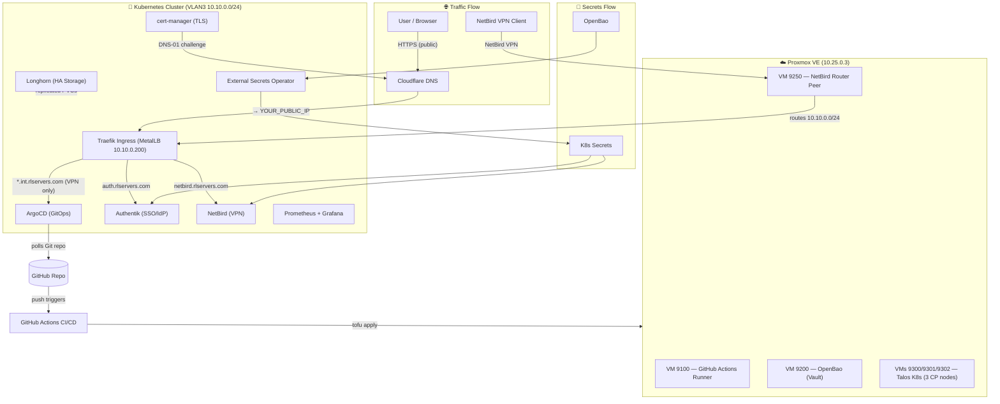

# InfraWeaver Platform 🚀

A **GitOps-driven, fully automated Kubernetes platform** deployed on Proxmox VE via Talos Linux.  
All secrets are randomly generated and stored in OpenBao — **zero hardcoded credentials in this repo**.

---

## Architecture



> **Traffic:** User → Cloudflare → Traefik → App  
> **Internal (VPN):** Device → NetBird → VLAN3 → Traefik → `*.int.rlservers.com`  
> **Secrets:** OpenBao → ESO → K8s Secret → Pod env var  
> **GitOps:** git push → ArgoCD auto-sync (~3 min) | Terraform changes → `platform.yml` workflow

```

## Public Services

| Service | URL | Notes |
|---------|-----|-------|
| Authentik SSO | `https://auth.rlservers.com` | Identity provider |
| NetBird Dashboard | `https://netbird.rlservers.com` | VPN web dashboard |
| NetBird API/gRPC | `https://api-netbird.rlservers.com` | Client connections (management, signal, relay) |

## Internal Services (NetBird VPN required)

| Service | URL | Notes |
|---------|-----|-------|
| 🏠 Homepage Dashboard | `https://home.rlservers.com` | All services + health status |
| ArgoCD | `https://argocd.int.rlservers.com` | GitOps UI |
| Grafana | `https://grafana.int.rlservers.com` | Metrics & logs |
| Longhorn | `https://longhorn.int.rlservers.com` | Distributed storage UI |
| OpenBao | `https://openbao.int.rlservers.com` | Secrets vault |
| AdGuard DNS | `https://adguard.int.rlservers.com` | Internal DNS |
| AWX (Ansible) | `https://awx.int.rlservers.com` | Automation |

## Access

### First Steps After Deployment

1. **Connect to NetBird VPN** — opens browser → Authentik SSO login → VPN connects
2. **Open Homepage Dashboard** — `https://home.rlservers.com` (all services + health status)
3. **Open OpenBao** — `https://openbao.int.rlservers.com` — use root token from deployment email
4. All other credentials are in OpenBao under `secret/platform/<service>`

### Authentik SSO (admin)
- **URL:** `https://auth.rlservers.com/if/admin/`
- **Username:** `remon` (or email: `remonhulst@gmail.com`)
- **Password:** `vault kv get -field=bootstrap-password secret/platform/authentik`

### NetBird VPN
- **SSO Login:** `netbird up --management-url https://api-netbird.rlservers.com` → browser opens automatically
- **Setup Key (headless):** In OpenBao `secret/platform/netbird` field `SETUP_KEY`

## GitOps Workflow

```
Push to main → ArgoCD detects diff → Deploys to productie cluster
                                      (automatic, ~3 min)

Full redeploy → GitHub Actions → Terraform (VMs) → Talos (K8s) → ArgoCD (apps)
                (workflow_dispatch: Full Redeploy — InfraWeaver Platform)
```

### Full Redeploy
Trigger via GitHub Actions → **Full Redeploy — InfraWeaver Platform**:
- Input: `environment = productie`, `confirm = DESTROY`
- Destroys and recreates all Talos VMs
- Seeds OpenBao with fresh random secrets
- Bootstraps ArgoCD → deploys all apps
- Creates Authentik admin user + NetBird bootstrap

## Repository Structure

```
├── terraform/                    # OpenTofu — Proxmox VMs + Talos cluster
│   ├── modules/
│   │   ├── talos-cluster/        # Talos VMs, bootstrap, kubeconfig
│   │   ├── platform-bootstrap/   # ArgoCD install + App-of-Apps
│   │   ├── cloud-init-template/  # Ubuntu template on Proxmox
│   │   ├── github-runner/        # Self-hosted runner VM
│   │   ├── openbao/              # Vault-compatible secrets engine
│   │   └── netbird-router/       # VPN routing peer VM
│   └── envs/
│       └── productie/            # Prod cluster spec
├── kubernetes/
│   ├── bootstrap/                # Root ApplicationSet (applied by OpenTofu once)
│   ├── core/                     # System components (ArgoCD-managed)
│   │   ├── argocd/
│   │   ├── cert-manager/
│   │   ├── external-secrets/     # ExternalSecrets → OpenBao
│   │   ├── longhorn/             # Distributed block storage
│   │   ├── metallb/              # LoadBalancer for bare-metal
│   │   ├── openbao/              # Vault in K8s (for cluster secrets)
│   │   └── traefik/              # Ingress + gRPC proxy
│   ├── apps/                     # Application workloads
│   │   ├── authentik/            # SSO identity provider
│   │   ├── homepage/             # Homelab dashboard (home.rlservers.com, VPN-only)
│   │   ├── netbird/              # VPN server (management/signal/relay/dashboard)
│   │   ├── grafana/              # Dashboards
│   │   ├── bitwarden/            # Password manager
│   │   ├── gitlab/               # Git server
│   │   └── ...
│   ├── external-routes/          # Traefik IngressRoutes + TLS certs
│   └── monitoring/               # Prometheus + Grafana + Loki
├── ansible/                      # Runner VM Ansible provisioning
├── .github/
│   ├── workflows/
│   │   ├── full-redeploy.yml     # Full cluster + platform redeploy
│   │   ├── platform.yml          # Incremental platform deploy
│   │   └── ...
│   └── memories/                 # Self-learning architecture notes
└── README.md
```

## Secrets Model

**No secrets in Git.** All secrets are:
1. Randomly generated at deploy time (GitHub Actions)
2. Stored in OpenBao (`secret/platform/<service>`)
3. Synced to K8s via ExternalSecret CRDs

```yaml
# Pattern: ExternalSecret pulls from OpenBao
apiVersion: external-secrets.io/v1beta1
kind: ExternalSecret
spec:
  secretStoreRef:
    name: openbao-cluster
    kind: ClusterSecretStore
  data:
    - secretKey: admin-password
      remoteRef:
        key: secret/platform/my-app
        property: admin-password
```

## Adding a New App

1. Create `kubernetes/apps/my-app/application.yaml` (ArgoCD Application)
2. Create `kubernetes/apps/my-app/values.yaml` (Helm values)
3. Create `kubernetes/apps/my-app/manifests/` for any extra K8s resources
4. Add an ExternalSecret if the app needs secrets from OpenBao
5. Add a Traefik IngressRoute in `kubernetes/external-routes/manifests/`
6. Push to `main` → ArgoCD deploys automatically

## Networking

### Cloudflare Proxy
All public traffic goes through Cloudflare (`rlservers.com`):
- **SSL mode: Full** (required for gRPC — Flexible breaks it)
- **HTTP/2: ON** (required for NetBird gRPC)
- gRPC works on Free plan when HTTP/2 + Full SSL is enabled

### Traefik IngressRoutes
- gRPC backends use `scheme: h2c` (cleartext HTTP/2 inside cluster)
- WebSocket (NetBird relay) uses `scheme: http` with Upgrade header passthrough
- VPN-only routes use `netbird-vpn-only` middleware (allowlist: 10.10.0.10/32)

### NetBird VPN
- SSO enrollment: client opens browser → Authentik PKCE flow → JWT
- Router peer (10.10.0.10) advertises entire internal subnet
- DNS: CoreDNS at 10.10.0.201 resolves `*.rlservers.com` internally

## Monitoring

- **Prometheus:** Scrapes all K8s components + service monitors
- **Grafana:** `https://grafana.rlservers.com` — dashboards for cluster + apps
- **Loki:** Log aggregation for all pods
- **AlertManager:** Alerts via email (`remonhulst@gmail.com`)

## Environment

| Attribute | Value |
|-----------|-------|
| Proxmox host | 10.25.0.3 (`proxmox` node) |
| K8s version | v1.35.4 (Talos 1.9.x) |
| Management VLAN | VLAN3 (10.10.0.0/24) |
| External IP | `<YOUR-PUBLIC-IP>` (set in Cloudflare DNS) |
| Domain | rlservers.com (Cloudflare) |
| Backup domain | yonavaarwater.nl, zonnevaarwater.nl, waterdance.nl |
